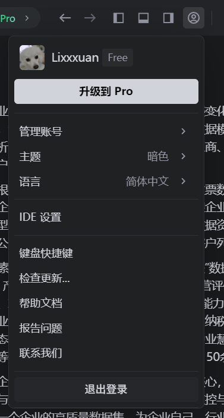
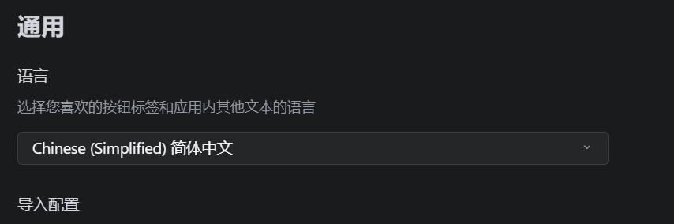
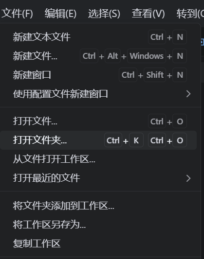
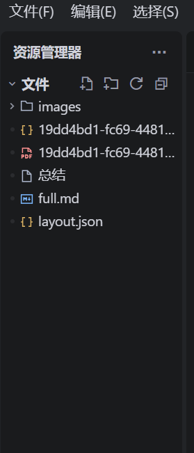
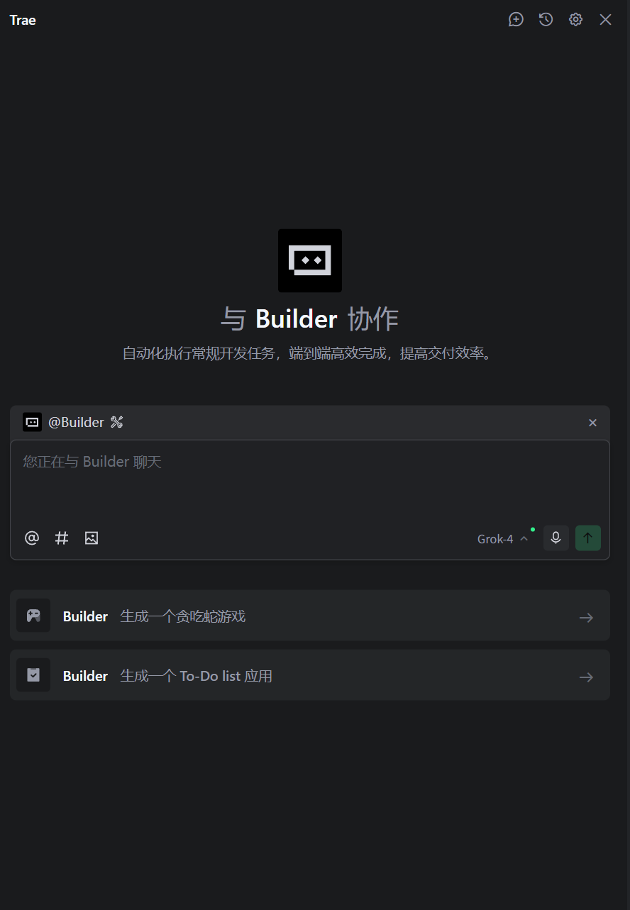
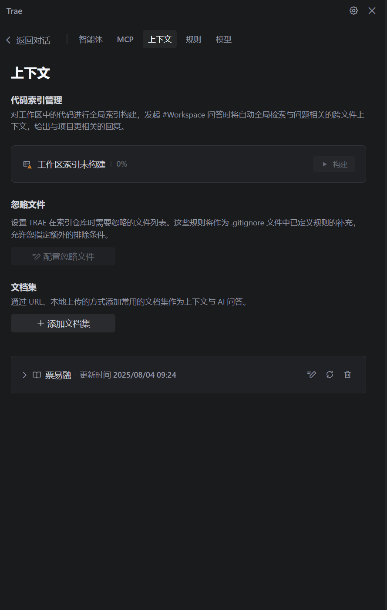
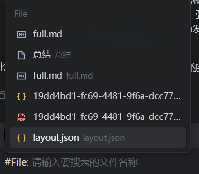
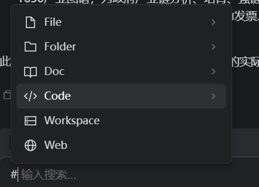
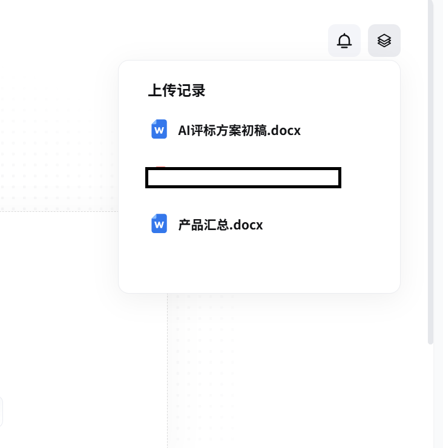
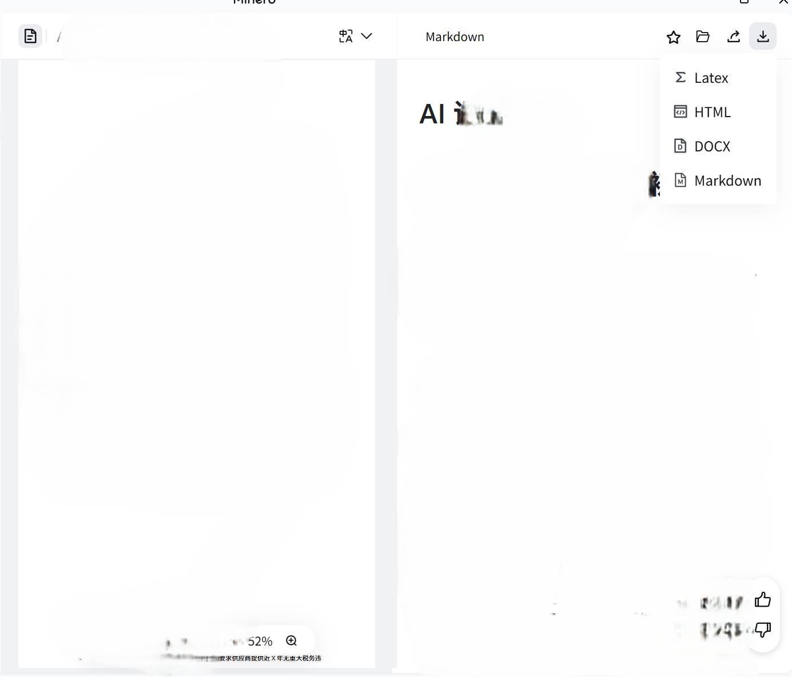

# Trae&MinerU的操作手册

## 安装
### 安装Trae

[安装包链接](https://1drv.ms/u/c/549e037d34dfc9bc/EcyjVB7Jp5tIkzT0RMLB3c0BN0eJ40KbHLMSON5Kx40SPw?e=KYE8I3)，下载后点击安装文件，一路默认安装即可。

### 安装MinerU
[官网](https://mineru.net/)，选择对应版本安装包安装即可。

### Trae的使用
找到IDE Settings，可以在设置中切换语言选项为中文。

切换后IDE会要求重启，重启后页面变为中文。

在文件选项中，选择打开文件夹选项，选择你所要概况或者使用的文件所在的文件夹，打开后会在页面左侧显示当前文件夹下的文件。

点击ai助手右上角的设置，进入详细设置界面

选择上下文选项，构建工作区索引后，ai就能索引刚刚打开的文件夹中的所有文件，并且根据其内容进行总结和回答。也可以点击添加文档集，上传对应的.txt文本文件或者.md文档文件。

点击返回对话，通过`#File:`指令去引用文件给ai作为回答依据。

输入`#`选择`Workspace`就可以让AI根据刚刚打开的工作区内的所有文件进行回答。

### MinerU的使用

首先在首页上传要处理的本地文件。

在上传记录中，可以看到文件的上传状态。

上传完成后点击右侧文件按钮，选择你需要下载的文件

双击文件后，可以选择下载转换后文件的方式，推荐选择`markdown`，下载后会生成名为`full.md`的文件，建议是重命名该文件，以防止下次生成覆盖。生成的md文件可以呗Trae使用
